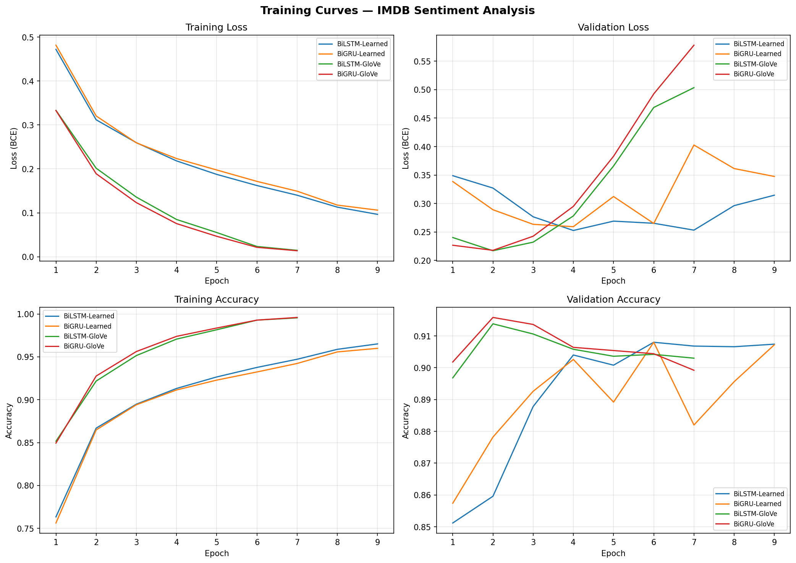
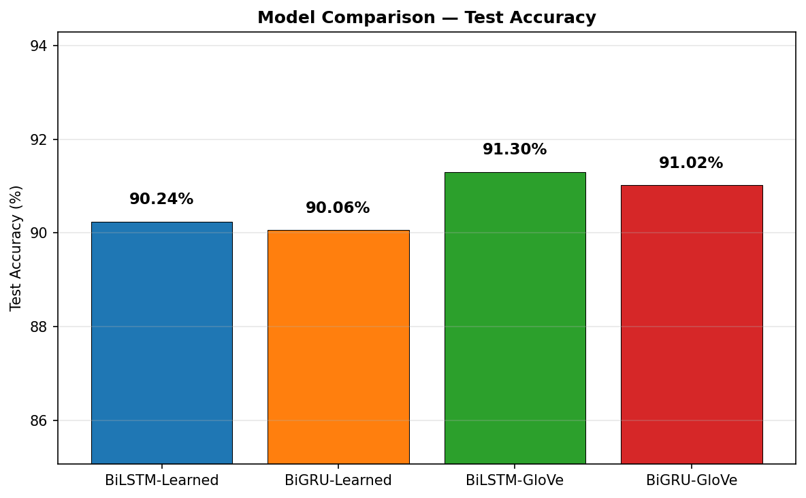

# Exercício 5 — Análise de Sentimento com RNNs (LSTM/GRU)

> **Relatório completo:** [`docs_pt/RELATORIO.md`](docs_pt/RELATORIO.md) — pré-processamento, arquitetura, parâmetros, resultados e 5 exemplos de teste.

## Enunciado

Implementar uma RNN (LSTM ou GRU) para análise de sentimento binária no dataset IMDB 50k (25k positivas, 25k negativas). Comparar embeddings aprendidos vs pré-treinados (GloVe).

## Como Executar

```bash
cd q_5/
python3 main.py
```

**Requisitos:** Python 3.10+, PyTorch >= 2.0, pandas, numpy, matplotlib, scikit-learn

**Tempo:** ~60-75 min dependendo do hardware (acelerado por MPS/CUDA).

**Primeira execução:** faz download dos embeddings GloVe (~862 MB) para `glove/`.

## Arquitetura

BiLSTM/BiGRU bidirecional (2 camadas, hidden=128) com self-attention + mean/max pooling sobre todos os hidden states. Classificação via concatenação dos 3 vetores (768d) → dropout → linear → sigmoid.

```
Entrada (batch, 300)
  → Embedding + Dropout(0.3)
  → BiLSTM/BiGRU (2 camadas, hidden=128)
  → [Self-Attention ‖ Mean Pool ‖ Max Pool] → (batch, 768)
  → Dropout(0.5) → Linear(768, 1) → Sigmoid
```

## Experimentos

| # | Modelo | Embeddings     | Acurácia | Perda   | Melhor Época | Parâmetros  |
|---|--------|----------------|----------|---------|--------------|-------------|
| 1 | BiLSTM | Aprendido-100d | 90,62%   | 0,2530  | 7            | 2.632.009   |
| 2 | BiGRU  | Aprendido-100d | 90,06%   | 0,2630  | 4            | 2.474.313   |
| 3 | **BiLSTM** | **GloVe-300d** | **91,22%** | **0,2232** | **2** | **6.837.209** |
| 4 | BiGRU  | GloVe-300d     | 91,02%   | 0,2347  | 2            | 6.628.313   |

**Melhor modelo: BiLSTM + GloVe-300d (91,22%)**

### Curvas de Treinamento





## Estrutura do Projeto

```
q_5/
├── notebook.ipynb            # Notebook interativo com código completo (português)
├── main.py                  # Ponto de entrada — executa os 4 experimentos
├── src/
│   ├── config.py            # Hiperparâmetros, seeds, device
│   ├── data.py              # Pré-processamento, vocabulário, DataLoaders, GloVe
│   ├── model.py             # SentimentRNN com self-attention e pooling
│   ├── train.py             # Loop de treinamento, avaliação, experimentos
│   └── visualize.py         # Gráficos, predições, tabelas
├── docs_pt/
│   └── RELATORIO.md         # Relatório técnico completo (português)
├── REPORT.md                # Relatório técnico completo (inglês)
├── IMDB Dataset.csv         # Dataset (50k resenhas)
├── results.json             # Resultados com histórico por época
├── example_predictions.txt  # 5 exemplos de teste
├── plots/                   # Visualizações
├── models/                  # Pesos salvos (.pt)
└── glove/                   # Embeddings GloVe (download automático)
```

## Referências

- Hochreiter & Schmidhuber (1997). Long Short-Term Memory.
- Cho et al. (2014). Learning Phrase Representations using RNN Encoder–Decoder.
- Pennington et al. (2014). GloVe: Global Vectors for Word Representation.
- Maas et al. (2011). Learning Word Vectors for Sentiment Analysis.
